# Parallel Matrix Multiplication Analysis (Part 2 – Exercises 1 and 2)

## 1. Introduction
Part 2 studies OpenMP matrix multiplication from two complementary viewpoints: how parallel constructs differ at a fixed thread budget, and how those constructs behave when thread count grows. Exercise 1 therefore focuses on strategy quality under equal parallel resources, while Exercise 2 focuses on scalability limits under increasing concurrency.

The core objective is causal interpretation. A faster curve is only meaningful when connected to a mechanism: lower runtime overhead, better work-sharing, fewer synchronization penalties, stronger pipeline utilization, or improved computational intensity. Throughout the report, the emphasis is on whether threads are spending more time doing useful arithmetic or more time paying coordination costs.

## 2. Experimental Setup
Exercise 1 uses a fixed 4-thread configuration and varies matrix size from 1024 to 3072 to isolate strategy-level OpenMP effects without changing thread budget. Exercise 2 fixes matrix size at 8192 and varies threads from 4 to 24 to expose scaling behavior, saturation, and diminishing returns. All results are collected from OpenMP executions instrumented with perf counters, enabling joint interpretation of runtime, throughput, IPC, and cache-related indicators.

The compared strategies are, in Exercise 1, OnMult with omp parallel for, OnMult with omp parallel + omp for, and OnMultLine with parallel execution; and, in Exercise 2, omp parallel for, omp parallel for collapse(2), and omp for simd.

## 3. Metrics Overview
Execution time captures whether a parallel strategy converts hardware resources into actual wall-clock reduction.

GFLOPS measures sustained floating-point throughput and therefore how much useful arithmetic is delivered per unit time.

Speedup indicates how much faster a parallel configuration runs relative to a baseline and is the primary indicator of practical scaling.

Efficiency normalizes speedup by thread growth, showing whether additional threads still contribute proportionally.

IPC (instructions per cycle) reflects how effectively cores are utilized during execution rather than stalled or underfed.

Cache miss rate provides context for whether memory-side pressure may be reinforcing or limiting observed parallel gains.

## 4. Exercise 1 – Parallel Strategy Comparison

### 4.1 Execution Time

The main trend is that strategies with simpler OpenMP structure maintain lower execution time as size grows. This happens because, with threads fixed, the decisive factor is not available parallel capacity but how much runtime overhead is attached to each unit of useful work. A compact construct such as omp parallel for reduces repeated control transitions and tends to keep threads inside productive loop work for a larger fraction of total time. In contrast, decomposing structure into separate omp parallel and omp for phases can increase bookkeeping and synchronization exposure, making overhead more visible as total workload expands.

The implication is that even when thread count is unchanged, execution quality depends strongly on orchestration design: a strategy that minimizes parallel-management cost preserves better runtime behavior across problem sizes.

### 4.2 GFLOPS

The dominant trend is that GFLOPS is consistently higher for strategies that spend less time in runtime coordination and more time in arithmetic kernels. This occurs because throughput is diluted whenever execution includes non-compute phases such as synchronization, scheduling administration, or thread-management transitions; even if total work is the same, more overhead reduces sustained GFLOPS. The comparative plot reinforces this interpretation: throughput separation tracks strategy structure rather than a change in available cores.

The slight decline at larger sizes is best interpreted as a practical scalability limit under fixed threads: as workload grows, maintaining the same ratio of useful compute to orchestration cost becomes harder, so throughput gains flatten. The implication is that higher GFLOPS here signals better parallel execution efficiency, not simply faster raw hardware behavior.

### 4.3 Speedup

The main trend is that speedup varies meaningfully across strategies even under the same thread count, indicating that parallel syntax alone does not guarantee equivalent acceleration. The underlying cause is that speedup measures net benefit after all coordination costs are paid, so strategies with extra synchronization points or heavier runtime structure can lose a substantial share of their potential gains. When a larger fraction of cycles is spent outside useful multiply-accumulate work, observed speedup deteriorates even if all threads are technically active.

The implication is that strategy choice directly controls how much theoretical parallel benefit survives in practice: lower-overhead constructs preserve stronger realized acceleration.

### 4.4 IPC

The main trend is that higher-performing strategies also tend to maintain healthier IPC behavior. This happens because IPC captures whether cores are productively retiring instructions versus waiting on stalls, synchronization delays, or control overhead. In a parallel context, reduced IPC often reflects that threads are not spending enough time in dense compute sections, which is consistent with excess orchestration work and reduced effective utilization.

The implication is that IPC serves as an efficiency cross-check: when runtime and GFLOPS are better and IPC is also stronger, the strategy is likely converting parallel threads into genuinely useful computation rather than simply increasing thread activity.

### 4.5 Short Cache Note

The main trend is that cache behavior changes with problem scale, but the differences do not appear to be the primary separator between OpenMP strategies in this exercise. Because thread count is fixed and the largest performance gaps align with construct-level overhead differences, cache curves should be interpreted as secondary context rather than dominant causal evidence here.

The implication is that Part 2 Exercise 1 conclusions are primarily about parallel structure quality; cache effects are present but not sufficient, on their own, to explain strategy ranking.

### 4.6 Strategy Comparison

The main comparative trend is that the strategy with tighter OpenMP integration tends to sustain better performance. The reason is structural: omp parallel for combines team management and loop scheduling in a single construct, usually reducing redundant transitions and synchronization boundaries. The split omp parallel + omp for form can be valuable for more complex control flows, but in this workload its additional structure appears to increase coordination cost without proportionally increasing useful compute throughput.

The implication is that, for this kernel shape, simpler OpenMP orchestration is not just cleaner code style; it is a direct performance advantage because it improves the useful-work-to-overhead ratio.

## 5. Exercise 2 – Thread Scaling Analysis

### 5.1 Execution Time vs Threads
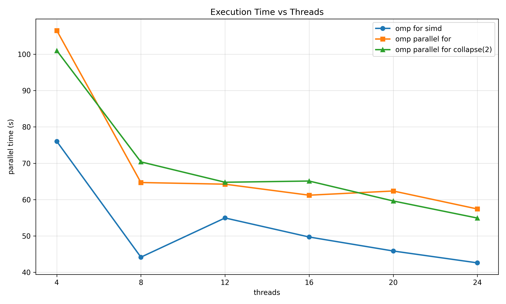

The main trend is an initial strong drop in execution time followed by progressively smaller improvements at higher thread counts. Early thread increases are effective because they parallelize a large remaining serial burden, so each added worker contributes meaningful wall-clock reduction. As thread count rises, however, non-compute costs become proportionally larger: synchronization, scheduling overhead, and contention for shared execution resources reduce the marginal benefit of extra parallel workers.

The implication is that scalability transitions from compute-limited to overhead-limited behavior, so thread growth eventually yields diminishing practical returns.

### 5.2 Speedup vs Threads
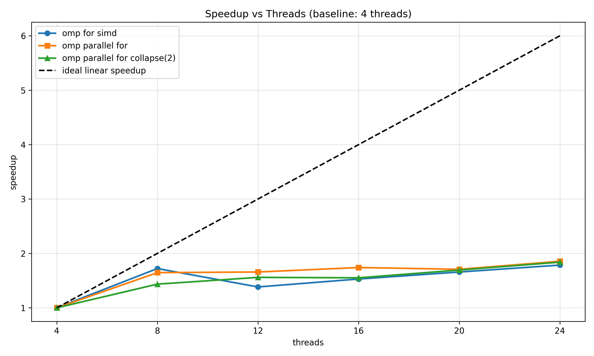

The main trend is sub-linear speedup with visible saturation as thread count increases. This happens because ideal linear scaling assumes zero overhead and perfectly independent progress, whereas real OpenMP execution pays increasing costs for coordination, barrier synchronization, and runtime scheduling as concurrency rises. In addition, threads compete for finite shared resources, so the system cannot sustain proportional throughput growth indefinitely.

The implication is that the practical saturation point marks where adding threads still increases activity but no longer produces equivalent acceleration, which is a direct signal of scaling limits.

### 5.3 Efficiency vs Threads
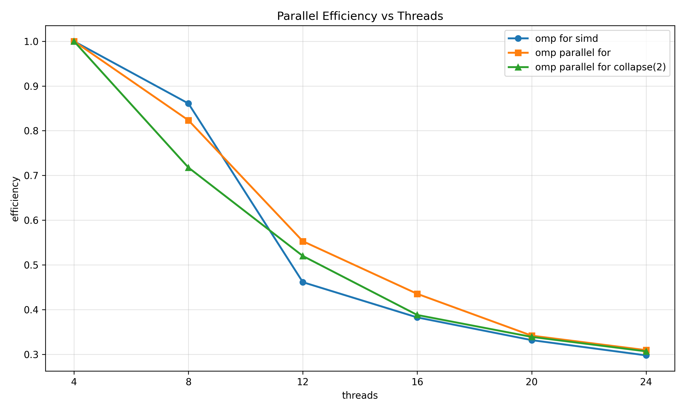

The main trend is decreasing efficiency as thread count rises. This occurs because efficiency measures how much each additional thread contributes relative to ideal scaling, and that contribution shrinks when overhead and contention grow faster than useful work. Even if total runtime still improves, a larger fraction of execution time is consumed by non-productive coordination costs at higher concurrency.

The implication is that throughput growth and efficiency decline can coexist: more threads may still help, but each added thread delivers less value than earlier ones.

### 5.4 GFLOPS vs Threads
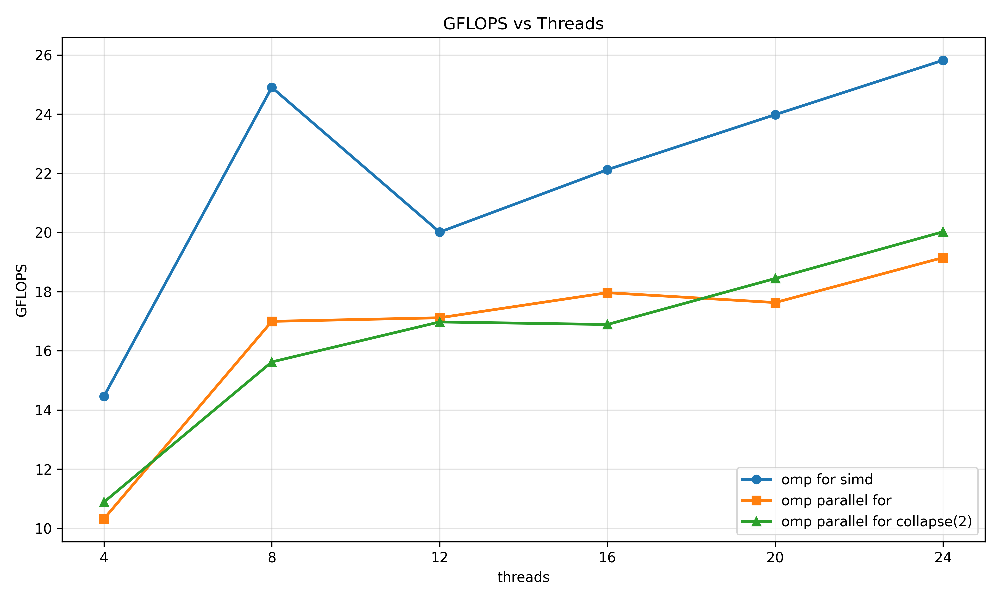

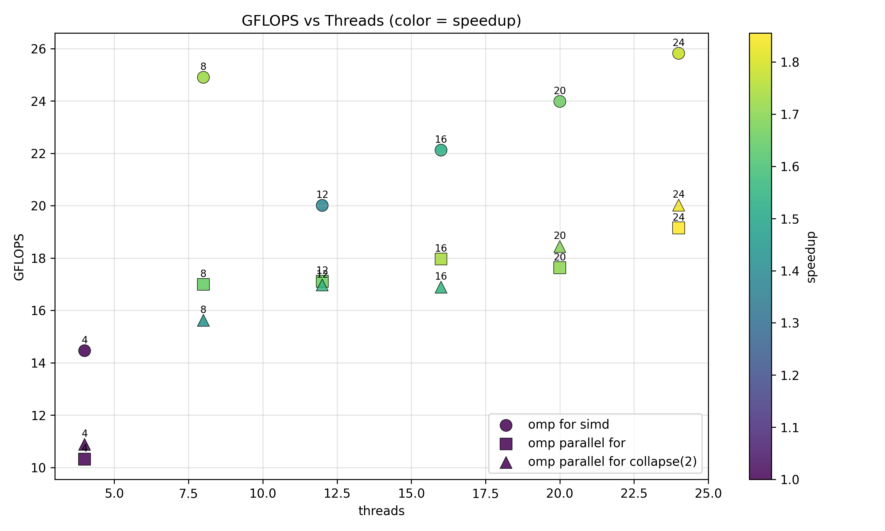

The main trend is increasing GFLOPS at low-to-mid thread counts followed by a plateauing region. The initial rise reflects successful exploitation of available parallelism: additional threads increase useful floating-point work completed per second. The later flattening indicates that extra concurrency increasingly translates into coordination pressure and shared-resource contention rather than proportional arithmetic throughput. The scatter view reinforces that thread count alone does not guarantee throughput growth once scaling enters a saturated regime.

The implication is that strategy quality under scaling is determined by how long it can delay this plateau and preserve productive per-thread contribution.

### 5.5 IPC vs Threads
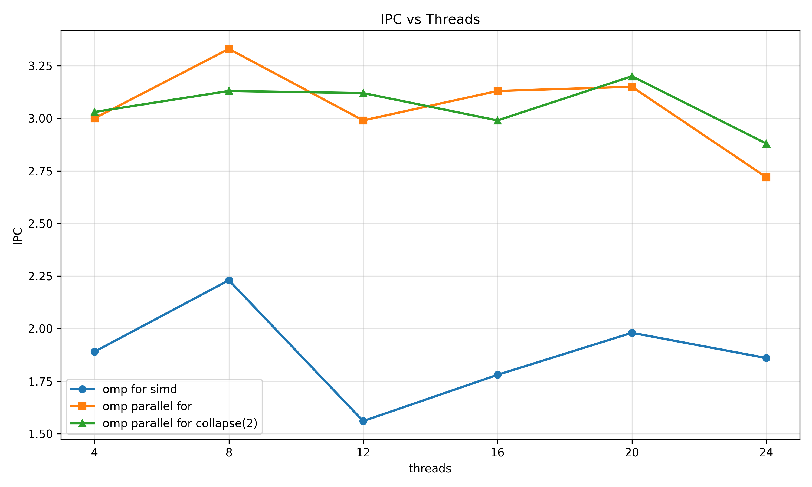

The main trend is that IPC does not increase proportionally with thread count and can soften as concurrency grows. This behavior occurs when additional threads create more synchronization waits, pipeline interruptions, or competition for execution resources, all of which reduce instructions retired per cycle. In other words, the machine is busier in aggregate but not necessarily more effective per cycle at high concurrency.

The implication is that weaker IPC at higher thread counts helps explain why speedup and efficiency curves saturate: added threads are increasingly absorbed by overhead and contention.

### 5.6 Advanced Scaling Insights
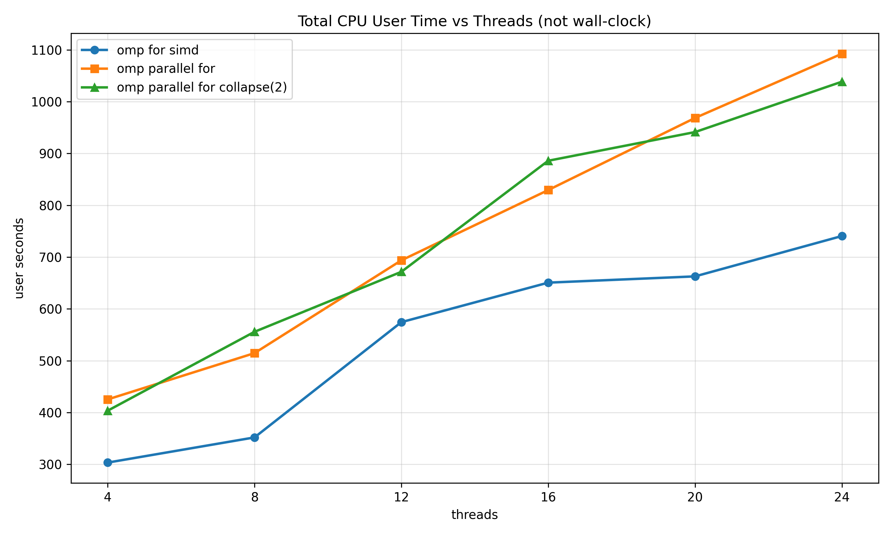

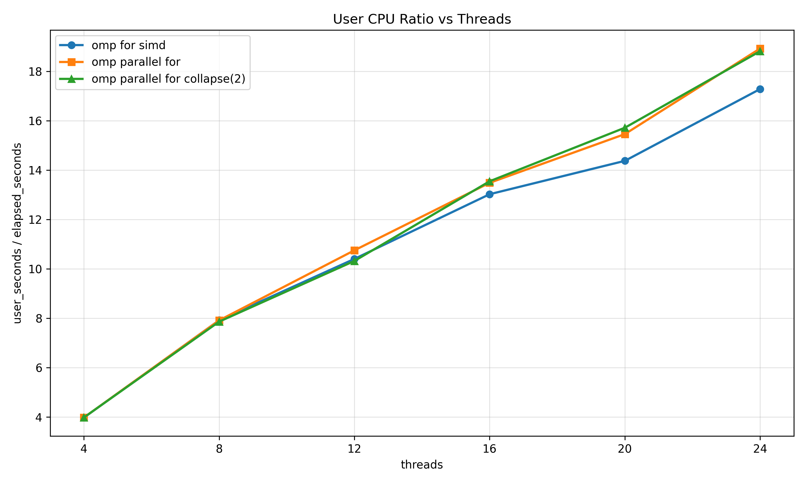

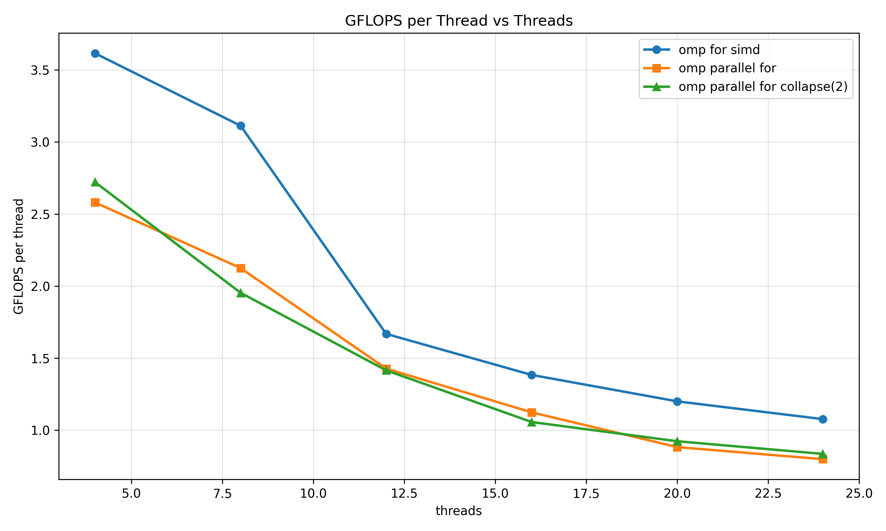

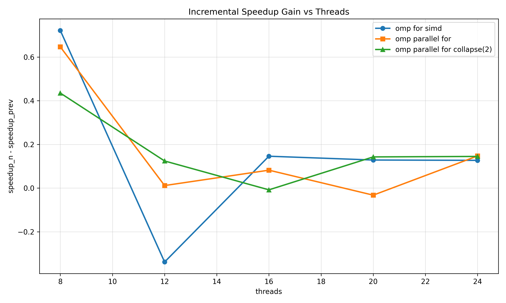

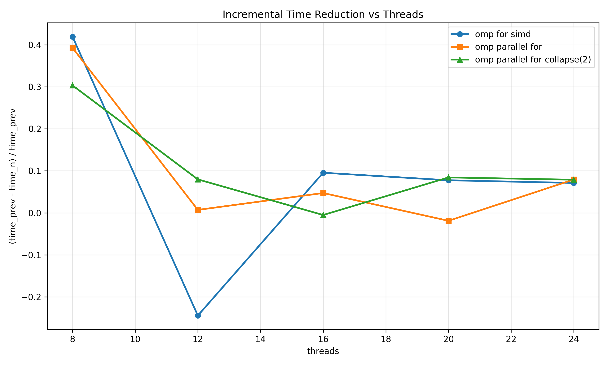

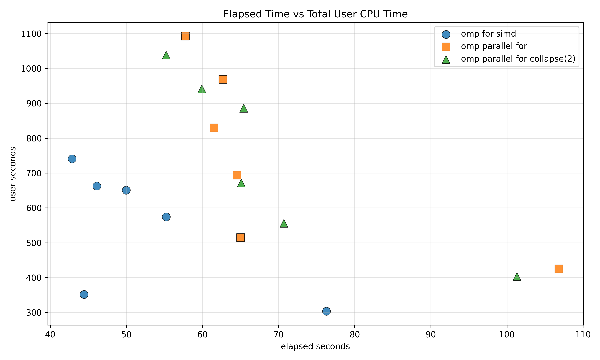

The dominant trend across these plots is that aggregate CPU effort increases steadily while marginal wall-clock benefit decreases. User time and user/elapsed ratio indicate that the system is consuming more total CPU work as threads rise, which is expected in parallel programs but becomes a concern when elapsed-time gains shrink. The incremental speedup and incremental time-reduction curves make this transition explicit: early thread increases deliver strong returns, then each additional step contributes less, revealing saturation.

GFLOPS per thread strengthens the same conclusion from a different angle. When per-thread throughput declines with higher thread counts, it suggests that new threads are not adding equivalent useful work, often because coordination and shared-resource contention are absorbing part of their potential. The elapsed-versus-user scatter is consistent with this trade-off: improving wall time increasingly requires disproportionately higher aggregate CPU effort.

The implication is that scalability quality must be judged by marginal gain, not only by absolute throughput: beyond the saturation region, extra threads may still improve performance, but with reduced cost-effectiveness.

### 5.7 Strategy Comparison
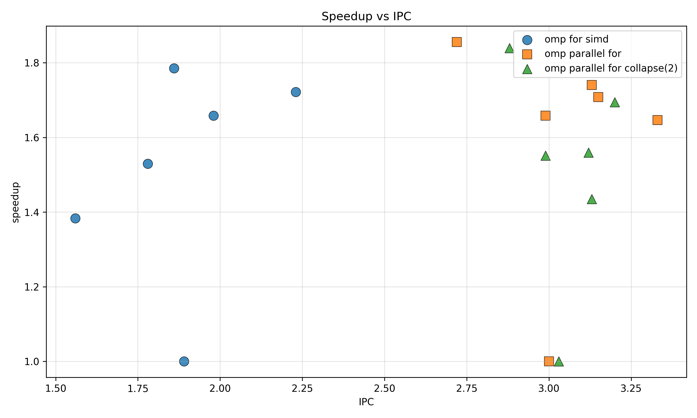

The main trend is that strategies do not occupy the same speedup-IPC region, indicating different balances between instruction-level efficiency and thread-level scaling. omp parallel for generally acts as a robust baseline because it keeps orchestration relatively simple. collapse(2) can improve load distribution when iteration-space partitioning is uneven, but any gain depends on whether improved balance outweighs added scheduling and coordination complexity. simd-oriented variants can raise per-thread computational effectiveness, yet their global scaling still depends on thread overhead and shared-resource pressure.

Because this scatter combines two metrics with different sensitivities, conclusions should remain cautious when point separation is small or overlapping. Even so, the implication is clear: the best strategy is the one that simultaneously preserves IPC quality and translates that efficiency into sustained speedup as threads increase.

## 6. Discussion
Across both exercises, the same causal pattern emerges: performance is controlled by the ratio of useful arithmetic to coordination cost. In Exercise 1, where threads are fixed, strategy structure explains most of the separation because orchestration overhead directly determines how much work cores can retire productively. In Exercise 2, where threads scale, initial acceleration is strong but gradually constrained by synchronization, runtime overhead, and shared-resource contention.

This means thread count is not a sufficient optimization target by itself. The decisive factor is whether additional concurrency increases useful work faster than it increases management cost. Once that condition no longer holds, speedup saturates, efficiency falls, and per-thread return weakens.

The practical interpretation is to treat scalability as an optimization window: exploit parallel growth where marginal gains are strong, but avoid assuming that maximum thread count is automatically the best operating point.

## 7. Conclusion
Part 2 shows that OpenMP performance quality depends primarily on overhead control, not on parallelism in name alone.  
Exercise 1 demonstrates that construct choice changes how effectively fixed threads perform useful work.  
Exercise 2 confirms that scaling is sub-linear in practice: speedup saturates and per-thread contribution declines as concurrency rises.  
The strongest strategy is therefore the one that delays saturation by minimizing coordination cost while preserving productive CPU utilization.
