# Parallel Matrix Multiplication Analysis (Part 2 – Exercise 1)

## 1. Introduction
This report analyzes how different OpenMP parallelization strategies affect matrix multiplication performance in Part 2 – Exercise 1.  
The comparison covers three implementations: **OnMult – omp parallel for**, **OnMult – omp parallel + omp for**, and **OnMultLine – parallel**, with emphasis on why their behavior differs under the same execution conditions.

## 2. Experimental Setup
- **Threads:** 4 OpenMP threads
- **Matrix sizes:** from 1024 to 3072
- **Performance tool:** `perf` for timing and hardware-counter-based metrics
- **Goal:** evaluate how OpenMP strategy and implementation structure impact efficiency

## 3. Metrics Overview
- **Execution time:** total elapsed runtime of each implementation.
- **GFLOPS:** computational throughput, indicating how much useful floating-point work is sustained.
- **Speedup:** gain relative to the serial baseline, showing parallel scalability quality.
- **IPC:** instructions per cycle, indicating how effectively CPU cycles are converted into useful instructions.
- **Cache miss rate:** fraction of accesses that miss cache levels, signaling memory-system pressure.

## 4. Results and Analysis

### 4.1 Execution Time
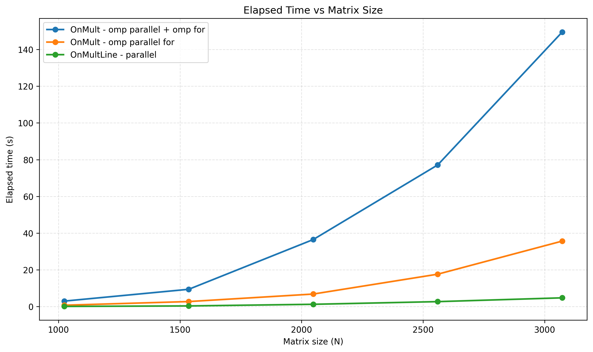

The best execution times are associated with the strategy that keeps thread orchestration simple and continuous. The `omp parallel for` form typically performs better because it fuses team creation and loop distribution into one construct, reducing control overhead and avoiding extra coordination work.  
The `omp parallel + omp for` variant tends to pay additional overhead from a more fragmented structure, where synchronization and runtime bookkeeping can become more visible as problem size grows.  
`OnMultLine – parallel` benefits when work is divided in larger, stable chunks per thread, which improves thread occupancy and reduces time spent in coordination relative to useful computation.

### 4.2 GFLOPS
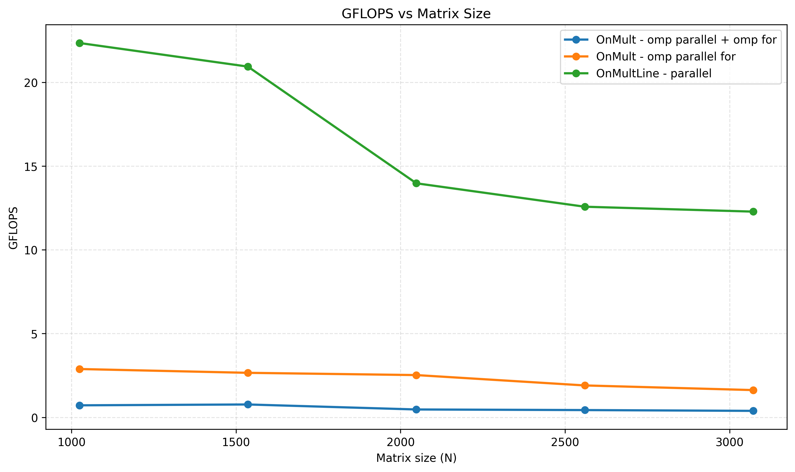

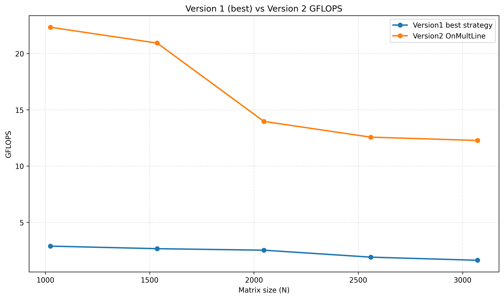

Higher GFLOPS appears when threads spend more time executing arithmetic and less time in runtime management. This is why the most streamlined OpenMP structure sustains better throughput: a larger share of wall time is productive work.  
Implementations with more synchronization or orchestration overhead show lower effective GFLOPS because non-compute phases dilute throughput.  
The slight degradation with increasing size reflects scalability limits from fixed thread count and growing parallel-management costs relative to idealized scaling.

### 4.3 Speedup
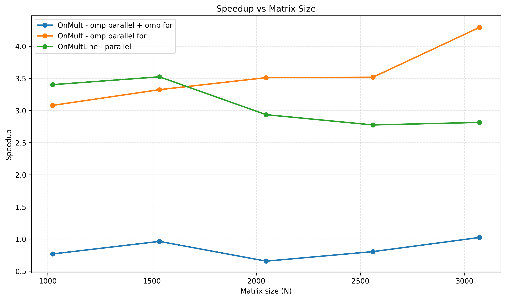

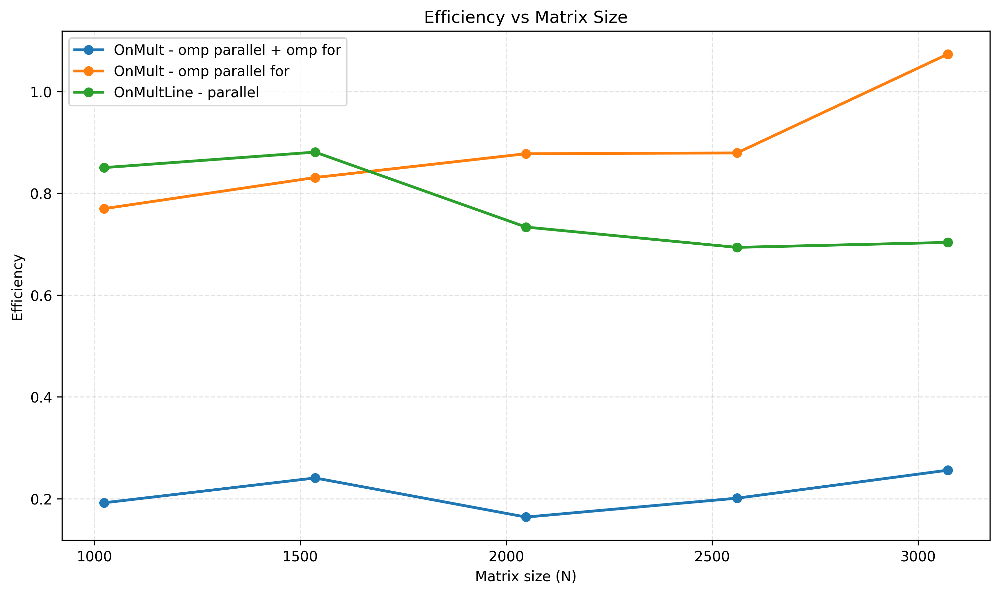

Speedup improves when parallel work is balanced and synchronization is infrequent. Strategies that minimize barriers and runtime transitions preserve stronger scaling behavior.  
When an implementation introduces extra OpenMP coordination points, speedup growth flattens because additional parallel overhead consumes part of the potential gain.  
The difference between `omp parallel for` and `omp parallel + omp for` highlights that OpenMP construct choice is not only syntactic: it changes execution overhead and therefore scalability.

### 4.4 IPC Analysis
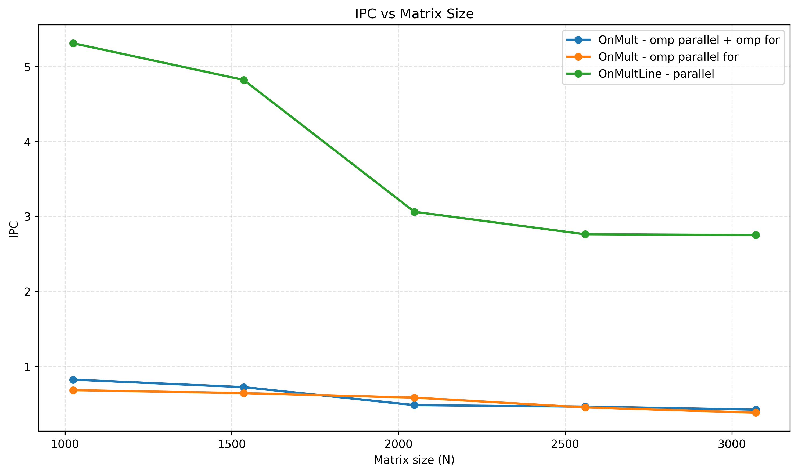

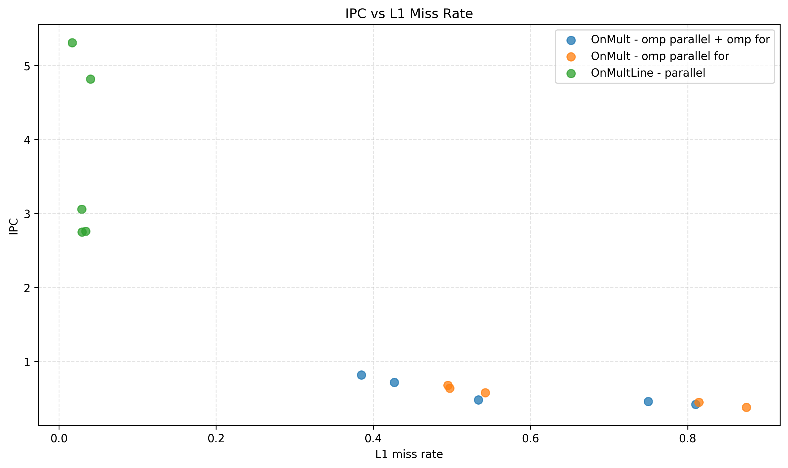

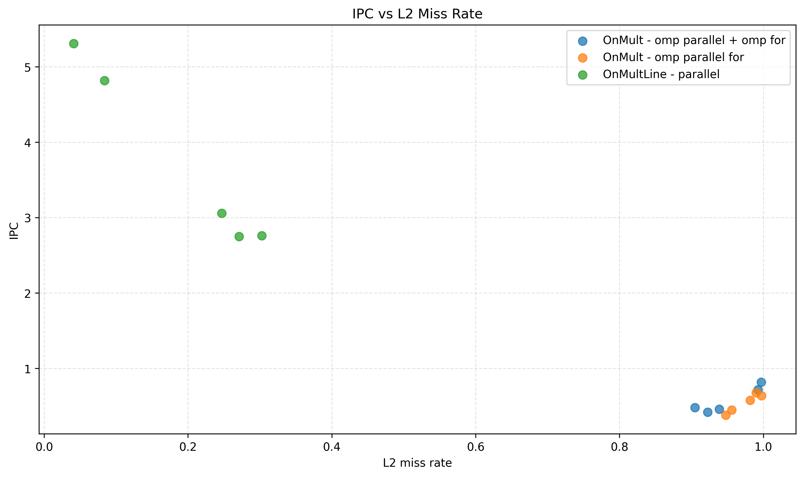

High IPC indicates that the processor pipeline is busy with useful instructions, which is consistent with efficient parallel execution and lower runtime friction.  
Lower IPC suggests more stalls and less effective cycle usage, often caused by synchronization waits, scheduling overhead, or pipeline underutilization in less efficient parallel structures.  
The IPC trend therefore supports the same conclusion seen in time and GFLOPS: the implementation with lower parallel overhead converts hardware cycles into useful work more effectively.

### 4.5 Cache Behavior (Short)
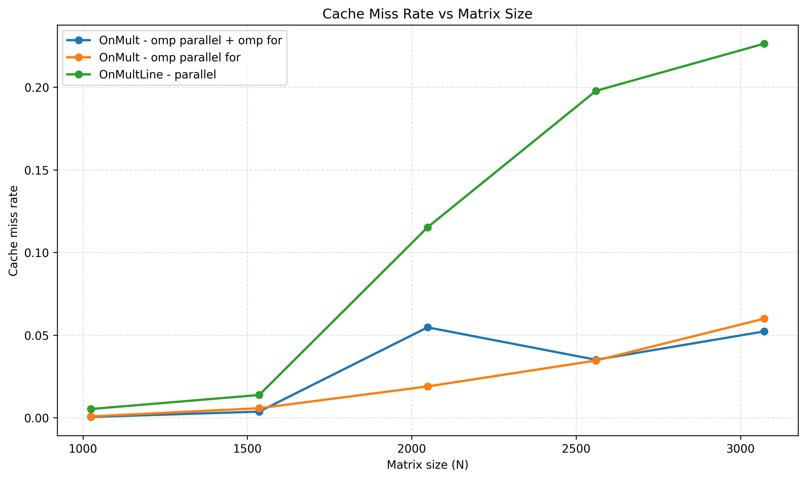

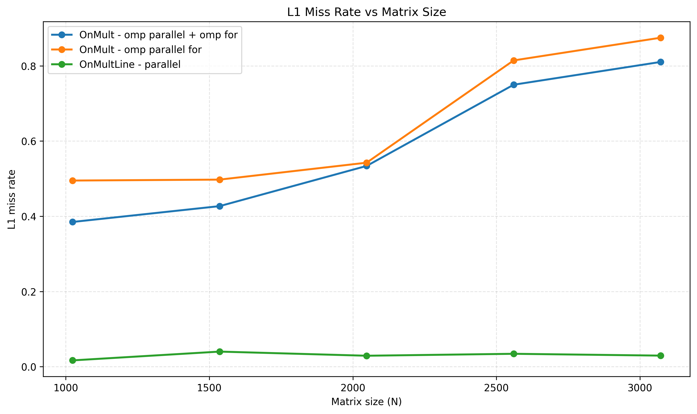

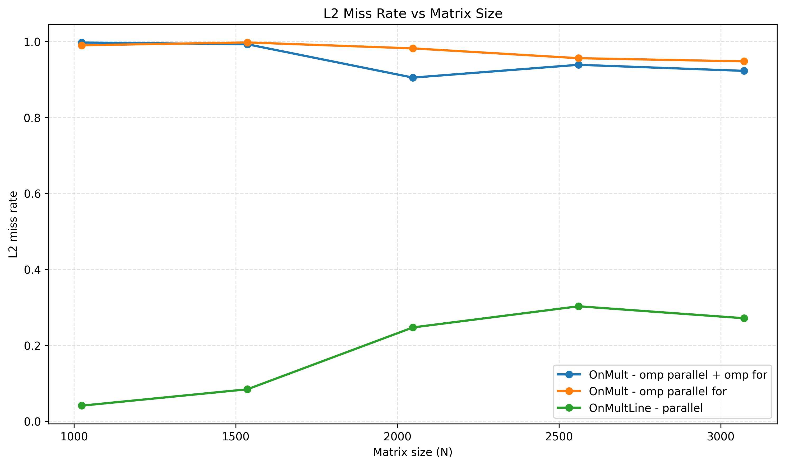

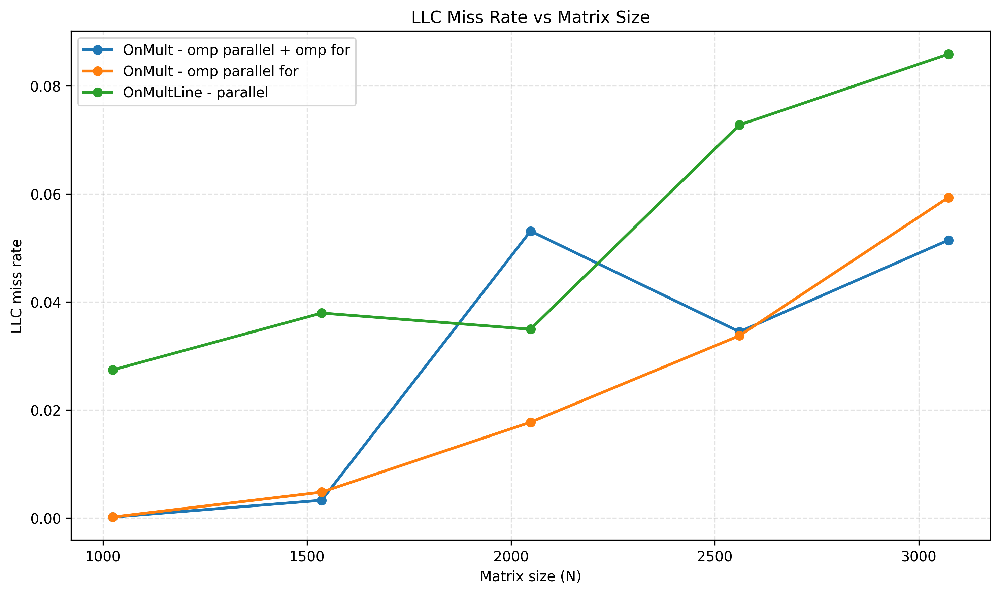

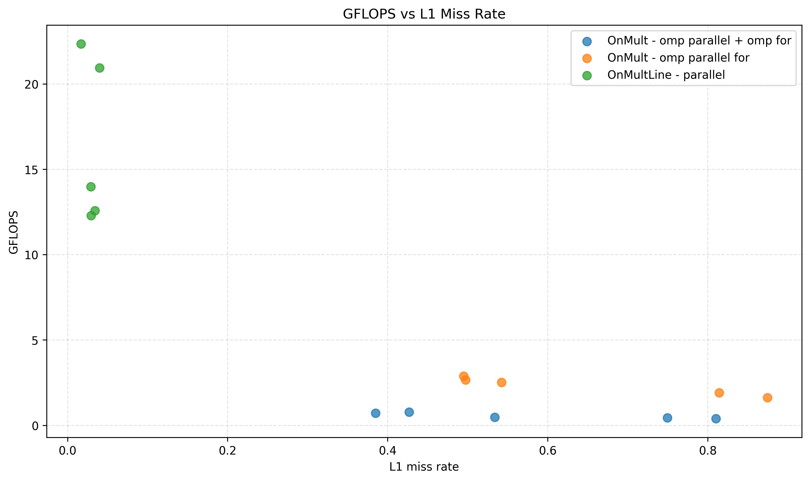

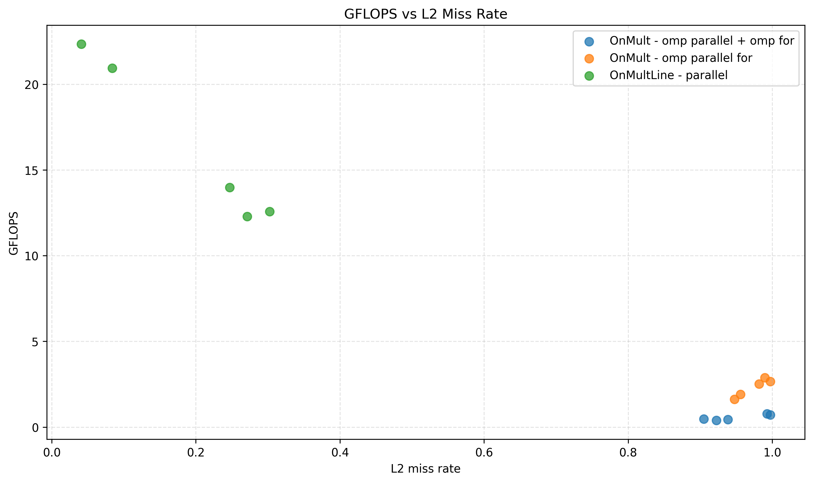

Cache effects are visible and do influence final performance, but in this part they are secondary to OpenMP strategy behavior.  
The main interpretation remains that differences in thread coordination overhead and parallel structure explain most of the observed separation between implementations.

## 5. OpenMP Strategy Comparison
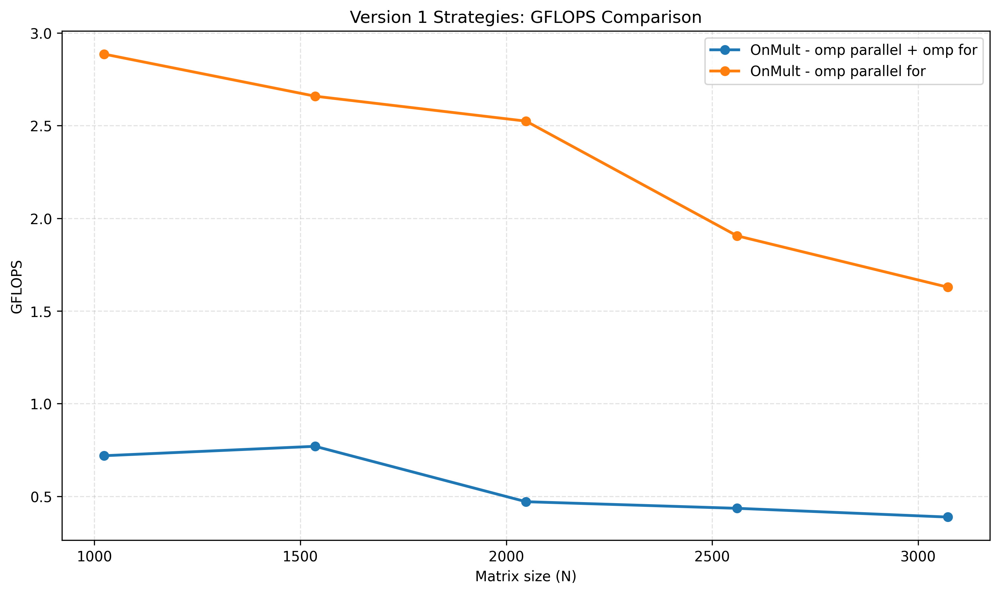

`omp parallel for` is generally preferable to `omp parallel + omp for` in this workload because it is a more compact execution model with less runtime overhead.  
By combining parallel region creation and loop scheduling in one directive, it reduces coordination cost and usually introduces fewer opportunities for unnecessary synchronization.  
`omp parallel + omp for` can still be useful in more complex regions, but for this case it tends to be structurally heavier and therefore less efficient.

## 6. Discussion
Parallel matrix multiplication performance is determined less by the presence of threads alone and more by how efficiently those threads are managed.  
The results show that minimizing OpenMP overhead is central to achieving consistent gains: useful compute time must dominate orchestration time.  
This also explains why adding parallel structure does not automatically improve performance; if synchronization and control costs grow, they can offset expected benefits.  
Implementation structure therefore matters as much as algorithmic intent for practical scalability.

## 7. Conclusion
The analysis shows that parallel efficiency depends on keeping OpenMP overhead low and useful work high.  
Across metrics, the strongest implementation is the one with the most direct thread-work mapping and least synchronization burden.  
Performance gains are real, but limited by coordination costs that grow with workload and fixed resources.  
In this exercise, the best strategy is the one that maximizes productive parallel execution rather than simply increasing parallel constructs.
